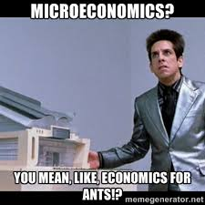

```{r setup, include=FALSE}
knitr::opts_chunk$set(echo = FALSE)
knitr::opts_chunk$set(warning = FALSE)
knitr::opts_chunk$set(message = FALSE)
library(xkcd)
library(tidyr)
library(dplyr)
```

## Introduction {.flexbox .vcenter}

```{r micro, echo=FALSE, out.width='100%'}

```

## What is Economics?

<iframe width="560" height="315" src="https://www.youtube.com/embed/AtOU-DAVch0?start=35" frameborder="0" allow="autoplay; encrypted-media" allowfullscreen></iframe>

## What is Economics?

At the core, economics is:

> - ~~the stock market~~

> - ~~business~~

> - **individual choice**

> - **how individual choice aggregates to social behaviors and policies**


## Micro vs. Macro

* Micro is the study of individual and firm choice.
  * "Do I make coffee or go to starbucks for a mocha?"
  * "What price should we charge for our new model of running shoe?"
* Macro is the study of how individual decisions aggregate and affect society as a whole.
  * "How is employment affected by the minimum wage?"
  * "How does trade with China affect the U.S.?"

## Economics has five key ideas:

* Scarcity
* Opportunity Cost
* Marginality
* We make choices to satisfy our self-interest
* Specialization


## What is Scarcity?

* Resources for which supply is limited for the amount desired/demanded

**Land** -- **Labor** -- **Infrastructure** -- **Human Capital** -- **Capital**

*What Else?*


## Opportunity Cost

<iframe width="560" height="315" src="https://www.youtube.com/embed/a0fWYtwvrww" frameborder="0" allow="autoplay; encrypted-media" allowfullscreen></iframe>

## Opportunity Cost

* What you must give up in making your choice
* Opportunity cost can be said to be the "true cost" of your choice.

```{r out.width = '75%'}
d1 <- data.frame(x = 1:22)
d1$y <- 25 - d1$x + rnorm(n = nrow(d1), mean = 0, sd = .2)
ggplot(data = d1) + 
  #xkcdline(data = d, aes(x = min(d$x), xend = max(d$x), y = min(d$y), yend = max(d$y)), color = "red", size = 2) + 
  geom_line(aes(x = x, y = y), color = "red", size = 0.5, alpha = .8) +
  xkcdaxis(c(0,25), c(0,25)) + 
  xlab("Naps") + ylab("Classes attended") +
  theme(text = element_text(size = 16, family = "Humor Sans"))
```


## Marginality

<iframe width="560" height="315" src="https://www.youtube.com/embed/cx-foylAP40?start=60" frameborder="0" allow="autoplay; encrypted-media" allowfullscreen></iframe>

## Marginality

* Marginality is the value of each additional unit of production or consumption

```{r marginality, out.width = '75%'}
d2 <- data.frame(x = 1:10)
d2$y <- log(d2$x) + rnorm(n = nrow(d2), mean = 0, sd = .01)
ggplot(data = d2) + 
  #xkcdline(data = d, aes(x = min(d$x), xend = max(d$x), y = min(d$y), yend = max(d$y)), color = "red", size = 2) + 
  geom_line(aes(x = x, y = y), color = "red", size = .5, alpha = .8) +
  xkcdaxis(range(d2$x), c(0,3)) + 
  xlab("Oreos") + ylab("Satisfaction") +
  theme(text = element_text(size = 16, family = "Humor Sans"))
```


## Choices are made to satisfy our self-interest

<iframe src="https://giphy.com/embed/z4bVNnaFUPtQI" width="480" height="282" frameBorder="0" class="giphy-embed" allowFullScreen></iframe><p><a href="https://giphy.com/gifs/funny-loki-thor-z4bVNnaFUPtQI">via GIPHY</a></p>

## Choices are made to satisfy our self-interest

* Not necessarily selfish: altruistic behavior may be in our own self-interest if we care about the well-being of others
  
```{r altruism, out.width = '75%'}
d3 <- data.frame(x = 1:10)
d3$you <- log(d3$x) + rnorm(n = nrow(d3), mean = 0, sd = .01)
d3$relative <- .5 * (log(d3$x) + rnorm(n = nrow(d3), mean = 0, sd = .01))
d3$stranger <- .1 * (log(d3$x) + rnorm(n = nrow(d3), mean = 0, sd = .01))
d3a <- gather(d3, person, value, -x)
d3a$person <- factor(d3a$person, levels = c("stranger", "relative", "you"))
ggplot(data = d3a) + 
  #xkcdline(data = d, aes(x = min(d$x), xend = max(d$x), y = min(d$y), yend = max(d$y)), color = "red", size = 2) + 
  geom_line(aes(x = x, y = value, group = person, color = person), size = .5, alpha = .8) +
  xkcdaxis(range(d3$x), c(0,4)) + 
  xlab("Warm meals per week") + ylab("Satisfaction") +
  theme(text = element_text(size = 16, family = "Humor Sans"))
```

## Specialization

* "Jack of all trades, master of none."
* We do better if we focus our energies on mastering one skill than if we try to do too many things at once.

```{r specialization, out.width = '75%'}
d4 <- data.frame(x = seq(0.01,.99,length.out = 100))
d4$y <- (100*d4$x)^(-.5) + rnorm(n = nrow(d4), mean = 0, sd = .0001)
d4$y <- 1 - d4$x^3 + rnorm(n = nrow(d4), mean = 0, sd = .001)
ggplot(data = d4) + 
  #xkcdline(data = d, aes(x = min(d$x), xend = max(d$x), y = min(d$y), yend = max(d$y)), color = "red", size = 2) + 
  geom_line(aes(x = x, y = y), size = .5, alpha = .8, color = "red") +
  xkcdaxis(range(0, 1), c(0, 1)) + 
  xlab("Ability as a dancer") + ylab("Ability as a musician") +
  theme(text = element_text(size = 16, family = "Humor Sans"))
```

## Wrapping Up

* Complete the [knowledge check](https://goo.gl/forms/1XOfCyiJ6Jt1NR8J3) for today's participation point.

* Please provide [feedback](https://goo.gl/forms/8SiOwdi19kN8cINJ3) on today's lecture.
