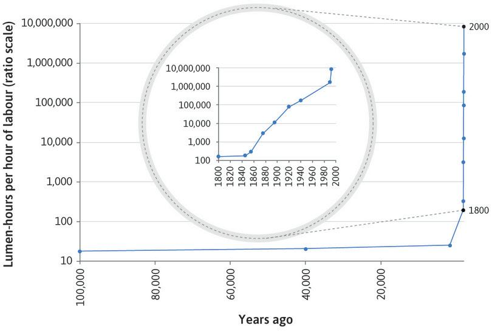

```{r setup, include=FALSE}
knitr::opts_chunk$set(echo = FALSE)
knitr::opts_chunk$set(warning = FALSE)
knitr::opts_chunk$set(message = FALSE)
library(xkcd)
library(tidyr)
library(dplyr)
```

## Feedback

<h3 style="color: green;">Good: </h3>

* Enjoyed the videos
* Real life examples like naps and oreos
* Relatable content and examples

<h3 style="color: red;">Needs improvement: </h3>

* Use the mic
* Go slower, not enough time to take notes
* Provide concrete terms and definitions


## Trade-offs

Since resources are **scarce**, we have to make **trade-offs**. We can't both *take a nap* and *go to class*, as much as we might want to.

<iframe src="https://giphy.com/embed/2YehS22GFOIsK1yWEV" width="480" height="270" frameBorder="0" class="giphy-embed" allowFullScreen></iframe><p><a href="https://giphy.com/gifs/ifc-funny-season-2-2YehS22GFOIsK1yWEV">via GIPHY</a></p>


## Trade-offs

```{r out.width = '75%'}
d1 <- data.frame(x = 1:22)
d1$y <- 25 - d1$x + rnorm(n = nrow(d1), mean = 0, sd = .2)
ggplot(data = d1) + 
  #xkcdline(data = d, aes(x = min(d$x), xend = max(d$x), y = min(d$y), yend = max(d$y)), color = "red", size = 2) + 
  geom_line(aes(x = x, y = y), color = "red", size = 0.5, alpha = .8) +
  xkcdaxis(c(0,25), c(0,25)) + 
  xlab("Naps") + ylab("Classes attended") +
  theme(text = element_text(size = 16, family = "Humor Sans"))
```


## Production { .flexbox .vcenter }

```{r production, out.width = "100%"}
d1 <- data.frame(t = 0:16)
d1$hw1 <- 40 + log(d1$t+1)/max(log(d1$t)) * 55
d1$hw2 <- 20 + log(d1$t+1, base = exp(2))/max(log(d1$t), base = exp(2)) * 400

x1 <- 2
x2 <- x1 + 1
x3 <- 13
x4 <- x3 + 1

ggplot(data = d1) + 
  #xkcdline(data = d, aes(x = min(d$x), xend = max(d$x), y = min(d$y), yend = max(d$y)), color = "red", size = 2) + 
  geom_line(aes(x = t, y = hw1), color = "red", size = 1, alpha = .8) +
  xkcdaxis(c(0,16), c(0,100)) + 
  geom_segment(aes(x = x1, xend = x1, y = 0, yend = d1[d1$t == x1,]$hw1), color = "deepskyblue4", linetype = 2, alpha = .9) +
  geom_segment(aes(x = 0, xend = x1, y = d1[d1$t == x1,]$hw1, yend = d1[d1$t == x1,]$hw1), color = "deepskyblue4", linetype = 2, alpha = .9) +
  geom_segment(aes(x = x2, xend = x2, y = 0, yend = d1[d1$t == x2,]$hw1), color = "deepskyblue4", linetype = 2, alpha = .9) +
  geom_segment(aes(x = 0, xend = x2, y = d1[d1$t == x2,]$hw1, yend = d1[d1$t == x2,]$hw1), color = "deepskyblue4", linetype = 2, alpha = .9) +
  geom_segment(aes(x = x3, xend = x3, y = 0, yend = d1[d1$t == x3,]$hw1), color = "seagreen2", linetype = 2, alpha = .9) +
  geom_segment(aes(x = 0, xend = x3, y = d1[d1$t == x3,]$hw1, yend = d1[d1$t == x3,]$hw1), color = "seagreen2", linetype = 2, alpha = .9) +
  geom_segment(aes(x = x4, xend = x4, y = 0, yend = d1[d1$t == x4,]$hw1), color = "seagreen2", linetype = 2, alpha = .9) +
  geom_segment(aes(x = 0, xend = x4, y = d1[d1$t == x4,]$hw1, yend = d1[d1$t == x4,]$hw1), color = "seagreen2", linetype = 2, alpha = .9) +
  #xkcdline(data = d1, aes(x = 5, xend = 5, y = 0, yend = d1[d1$t == 5,]$hw1), linetype = 2) +
  xlab("Hours Running") + ylab("Final Rank") +
  theme(text = element_text(size = 16, family = "Humor Sans"))
```


## Production { .flexbox .vcenter }

```{r btc, out.width = "100%"}
d2 <- data.frame(t = 0:1000)
d2$btc <- d2$t*.001

x1 <- 100
x2 <- x1 + 10
x3 <- 900
x4 <- x3 + 10

ggplot(data = d2) + 
  #xkcdline(data = d, aes(x = min(d$x), xend = max(d$x), y = min(d$y), yend = max(d$y)), color = "red", size = 2) + 
  geom_line(aes(x = t, y = btc), color = "red", size = 1, alpha = .8) +
  #xkcdaxis(c(0,16), c(0,100)) + 
  geom_segment(aes(x = x1, xend = x1, y = 0, yend = d2[d2$t == x1,]$btc), color = "deepskyblue4", linetype = 2, alpha = .9) +
  geom_segment(aes(x = 0, xend = x1, y = d2[d2$t == x1,]$btc, yend = d2[d2$t == x1,]$btc), color = "deepskyblue4", linetype = 2, alpha = .9) +
  geom_segment(aes(x = x2, xend = x2, y = 0, yend = d2[d2$t == x2,]$btc), color = "deepskyblue4", linetype = 2, alpha = .9) +
  geom_segment(aes(x = 0, xend = x2, y = d2[d2$t == x2,]$btc, yend = d2[d2$t == x2,]$btc), color = "deepskyblue4", linetype = 2, alpha = .9) +
  geom_segment(aes(x = x3, xend = x3, y = 0, yend = d2[d2$t == x3,]$btc), color = "seagreen2", linetype = 2, alpha = .9) +
  geom_segment(aes(x = 0, xend = x3, y = d2[d2$t == x3,]$btc, yend = d2[d2$t == x3,]$btc), color = "seagreen2", linetype = 2, alpha = .9) +
  geom_segment(aes(x = x4, xend = x4, y = 0, yend = d2[d2$t == x4,]$btc), color = "seagreen2", linetype = 2, alpha = .9) +
  geom_segment(aes(x = 0, xend = x4, y = d2[d2$t == x4,]$btc, yend = d2[d2$t == x4,]$btc), color = "seagreen2", linetype = 2, alpha = .9) +
  #xkcdline(data = d1, aes(x = 5, xend = 5, y = 0, yend = d1[d1$t == 5,]$hw1), linetype = 2) +
  xlab("Electricity (kwh)") + ylab("Bitcoins") +
  theme(text = element_text(size = 16, family = "Humor Sans"))
```

## Marginality

* **Marginality** -  *The cost or benefit of an additional item.*


## Marginality in Production

* **Average product** - *The average amount of __production__ per unit of input.* 

* **Marginal product** - *The additional __production__ from increasing a single unit of input.*


## Marginality in Production

[Figure 3.5 from The Economy](https://core-econ.org/the-economy/book/text/03.html#figure-3-5a)

## Marginality in Consumption

* **Utility** - *The quality or condition of being useful; usefulness.*

> - KILLMENOW.GIF

> - **Utility** - *the advantage, pleasure, or fulfillment a person gains from obtaining or consuming a good or service.*


## Marginality of Consumption

```{r marginal_consumption, out.width = "100%"}
d1 <- data.frame(t = 0:16)
d1$hw1 <- 40 + log(d1$t+1)/max(log(d1$t)) * 55
d1$hw2 <- 20 + log(d1$t+1, base = exp(2))/max(log(d1$t), base = exp(2)) * 400

x1 <- 2
x2 <- x1 + 1
x3 <- 13
x4 <- x3 + 1

ggplot(data = d1) + 
  #xkcdline(data = d, aes(x = min(d$x), xend = max(d$x), y = min(d$y), yend = max(d$y)), color = "red", size = 2) + 
  geom_line(aes(x = t, y = hw1), color = "red", size = 1, alpha = .8) +
  xkcdaxis(c(0,16), c(0,100)) + 
  geom_segment(aes(x = x1, xend = x1, y = 0, yend = d1[d1$t == x1,]$hw1), color = "deepskyblue4", linetype = 2, alpha = .9) +
  geom_segment(aes(x = 0, xend = x1, y = d1[d1$t == x1,]$hw1, yend = d1[d1$t == x1,]$hw1), color = "deepskyblue4", linetype = 2, alpha = .9) +
  geom_segment(aes(x = x2, xend = x2, y = 0, yend = d1[d1$t == x2,]$hw1), color = "deepskyblue4", linetype = 2, alpha = .9) +
  geom_segment(aes(x = 0, xend = x2, y = d1[d1$t == x2,]$hw1, yend = d1[d1$t == x2,]$hw1), color = "deepskyblue4", linetype = 2, alpha = .9) +
  geom_segment(aes(x = x3, xend = x3, y = 0, yend = d1[d1$t == x3,]$hw1), color = "seagreen2", linetype = 2, alpha = .9) +
  geom_segment(aes(x = 0, xend = x3, y = d1[d1$t == x3,]$hw1, yend = d1[d1$t == x3,]$hw1), color = "seagreen2", linetype = 2, alpha = .9) +
  geom_segment(aes(x = x4, xend = x4, y = 0, yend = d1[d1$t == x4,]$hw1), color = "seagreen2", linetype = 2, alpha = .9) +
  geom_segment(aes(x = 0, xend = x4, y = d1[d1$t == x4,]$hw1, yend = d1[d1$t == x4,]$hw1), color = "seagreen2", linetype = 2, alpha = .9) +
  #xkcdline(data = d1, aes(x = 5, xend = 5, y = 0, yend = d1[d1$t == 5,]$hw1), linetype = 2) +
  xlab("Oreos") + ylab("Utility") +
  theme(text = element_text(size = 16, family = "Humor Sans"))
```


## Marginality in Consumption

* **Average utility** - The average amount of **utility** per unit of consumption. 

* **Marginal utility** - The additional **utility** from consuming an additional unit.


## WSU: An example

WSU Tuition: \$5,134

Cost of classes:

| Classes | Total Cost | Marginal Cost | Average Cost | 
| ------- | ----------:| -------------:| ------------:|
| 1       | 1000       | 1000          | 1000         |
| 2       | 1750       | 750           | 875          |
| 3       | 2350       | ???           | 783.3        |
| 4       | ????       | 250           | ???          |
| 5       | 2850       | 250           | 570          |


## Possibility Frontiers

* **Production possibility frontier** - *the line denoting how much of one good can be produced given production of all other goods.*

*What do we want to produce with our resources?*

* **Consumption possiblity frontier** - *the line denoting how much of one good we can afford to consume given consumption of all other goods.*

*How do we want to spend our money?*


## Production possibility frontier

[Figure 3.9 from The Economy](https://core-econ.org/the-economy/book/text/03.html#figure-3-9a)


## Opportunity Cost

* **Opportunity Cost** - *The value of the best alternative we must give up when we make a choice.*


## Increasing Opportunity Cost

```{r inc_opp_cost, echo=FALSE, out.width='100%'}

d4 <- data.frame(t = seq(0.01,.99,length.out = 100))
d4$y <- 1 - d4$t^4 + rnorm(n = nrow(d4), mean = 0, sd = .001)

x1 <- min(d4$t)
x2_idx <- which.min(abs(d4$y - 0.75))
x3_idx <- which.min(abs(d4$y - 0.5))
x4_idx <- which.min(abs(d4$y - 0.25))


ggplot(data = d4) + 
  #xkcdline(data = d, aes(x = min(d$x), xend = max(d$x), y = min(d$y), yend = max(d$y)), color = "red", size = 2) + 
  geom_line(aes(x = t, y = y), size = .5, alpha = .8, color = "red") +
  geom_segment(aes(x = x1, xend = x1, y = min(d4$y), yend = max(d4$y)), color = "deepskyblue4", linetype = 2) +
  geom_segment(aes(x = 0, xend = x1, y = max(d4$y), yend = max(d4$y)), color = "deepskyblue4", linetype = 2) +
  geom_segment(aes(x = d4[x2_idx,]$t, xend = d4[x2_idx,]$t, y = min(d4$y), yend = d4[x2_idx,]$y), color = "deepskyblue4", linetype = 2) +
  geom_segment(aes(x = 0, xend = d4[x2_idx,]$t, y = d4[x2_idx,]$y, yend = d4[x2_idx,]$y), color = "deepskyblue4", linetype = 2) +
  
  geom_segment(aes(x = d4[x3_idx,]$t, xend = d4[x3_idx,]$t, y = min(d4$y), yend = d4[x3_idx,]$y), color = "seagreen4", linetype = 2) +
  geom_segment(aes(x = 0, xend = d4[x3_idx,]$t, y = d4[x3_idx,]$y, yend = d4[x3_idx,]$y), color = "seagreen4", linetype = 2) +
  geom_segment(aes(x = d4[x4_idx,]$t, xend = d4[x4_idx,]$t, y = min(d4$y), yend = d4[x4_idx,]$y), color = "seagreen4", linetype = 2) +
  geom_segment(aes(x = 0, xend = d4[x4_idx,]$t, y = d4[x4_idx,]$y, yend = d4[x4_idx,]$y), color = "seagreen4", linetype = 2) +
  xkcdaxis(range(0, 1), c(0, 1)) + 
  xlab("Students who graduate") + ylab("Football games won") +
  theme(text = element_text(size = 16, family = "Humor Sans"))

```


## Economic Growth

```{r growth, echo=FALSE, out.width='75%'}
d5 <- data.frame(t = seq(0.01,.99,length.out = 100))
d5$y <- .75 - d5$t^4 + rnorm(n = nrow(d4), mean = 0, sd = .001)
d5[d5$y < 0.05,]$y <- NA

ggplot(data = d5) + 
  #xkcdline(data = d, aes(x = min(d$x), xend = max(d$x), y = min(d$y), yend = max(d$y)), color = "red", size = 2) + 
  geom_line(aes(x = t, y = y), size = .5, alpha = .8, color = "red") +
  xkcdaxis(range(0, 1), c(0, 1)) + 
  xlab("Animated movies (Frozen)") + ylab("Other movies (Mad Max)") +
  theme(text = element_text(size = 16, family = "Humor Sans"))
```


## Economic Growth

```{r growth2, echo=FALSE, out.width='75%'}
d5 <- data.frame(t = seq(0.01,.99,length.out = 100))
d5$before <- .75 - d5$t^4 + rnorm(n = nrow(d4), mean = 0, sd = .002)
d5[d5$before < 0.05,]$before <- NA
d5$after <- 1 - d5$t^4 + rnorm(n = nrow(d4), mean = 0, sd = .002)

d5a <- gather(d5, key = var, value = value, -t)
ggplot(data = d5a) + 
  #xkcdline(data = d, aes(x = min(d$x), xend = max(d$x), y = min(d$y), yend = max(d$y)), color = "red", size = 2) + 
  geom_line(aes(x = t, y = value, group = var, color = var), size = .5, alpha = .8) +
  xkcdaxis(range(0, 1), c(0, 1)) + 
  xlab("Animated movies (Frozen)") + ylab("Other movies (Mad Max)") +
  theme(text = element_text(size = 16, family = "Humor Sans"))
```


## Economic Growth

If we can produce more, we can provide more basic goods to people who need them, and more luxury goods to people who want them. *We become more well off.*

But how?

> - Increase in available resources

> - Technological advances


## Increased availability of resources

<iframe width="560" height="315" src="https://www.youtube.com/embed/YBSMavkvIKI" frameborder="0" allow="autoplay; encrypted-media" allowfullscreen></iframe>

## Technological advances {.flexbox .vcenter}

```{r micro, echo=FALSE, out.width='100%'}

```


## Wrapping Up

* Complete the [knowledge check](https://goo.gl/forms/L9w8WyzTnRS1QP6H2) for today's participation point.

* Please provide [feedback](https://goo.gl/forms/8SiOwdi19kN8cINJ3) on today's lecture.
